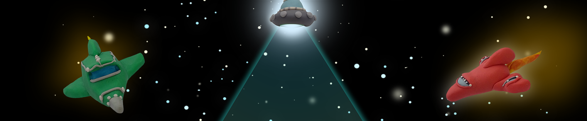
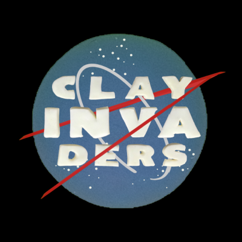

# Lore

<figure><figcaption></figcaption></figure>

Something magical and mysterious illuminated galaxies with a great force, which gave birth to a special moment in space called Granate.&#x20;

Approximately 46,582 shooting stars ago, the first Clay Invaders were seen on a distant Asteroid :comet:

They began to build a community, form entire civilizations, build advanced spaceships, and invade planets, all while being the Galaxies clumsiest and most adorable aliens :alien:

This is just the beginning of a lore that continues to be written by the community as they discover new planets, galaxies, and rare elements while having fun with their Clay Invaders :flying\_saucer:

Are you ready to receive your mission, Earthling?

<figure><figcaption></figcaption></figure>

### About Us

Others define us as monsters, aliens, or just creatures, we don't know. We just call ourselves _**Clay Invaders**_.\
\
We, fortunately, discovered that we can grow and evolve, we are very curious and we love to travel and discover unexplored spaces, we are not afraid of the accidents we suffer on each trip.\
\
Since we are created we have tried to grow and increase our rank, we seek to be unique and our rarity is what we adore the most\
\
Every trip we make leaves us with physical and mental marks. Against all intuition, in our community it is very well seen to be hurt, it shows that we are brave and strong.\
\
The first evolution of one of us was random, the following were not.\
\
Trips, training, and all the effort that we make allow us to achieve new ranks, special Suits, and SpaceShips.\
\
With the best Suits and SpaceShips, we could travel longer, and continue discovering new places, friends, and enemies.\
\
We are pacific when we invade new planets, but sometimes we do not succeed and must react accordingly.\
\
Most of us are adorable and chill, but sometimes clumsy and naughty.\
\
Our community has great vibes, and it's organized in a decentralized way.\
\
We have THE SPACE TREASURY with a token that we love to protect and make grow with investigations, projects, and inter-galaxy events.\
\
Planet exploration and discoveries produce significant benefits for it and for the whole community.
