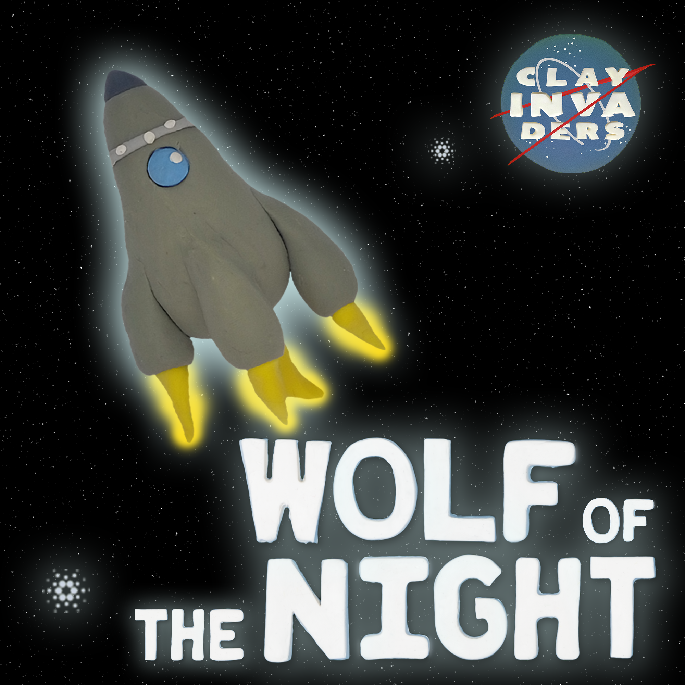
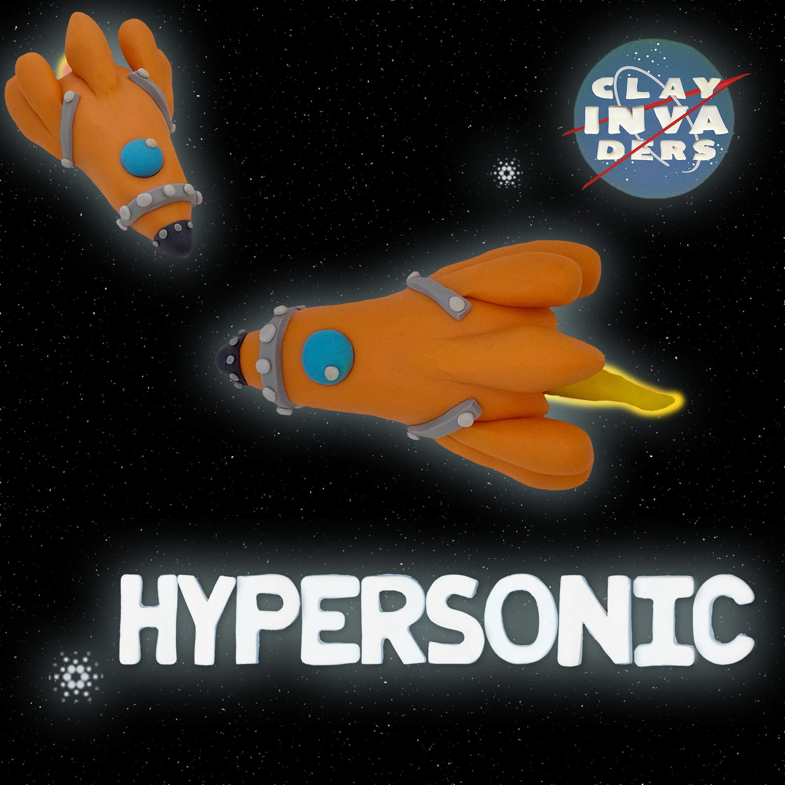
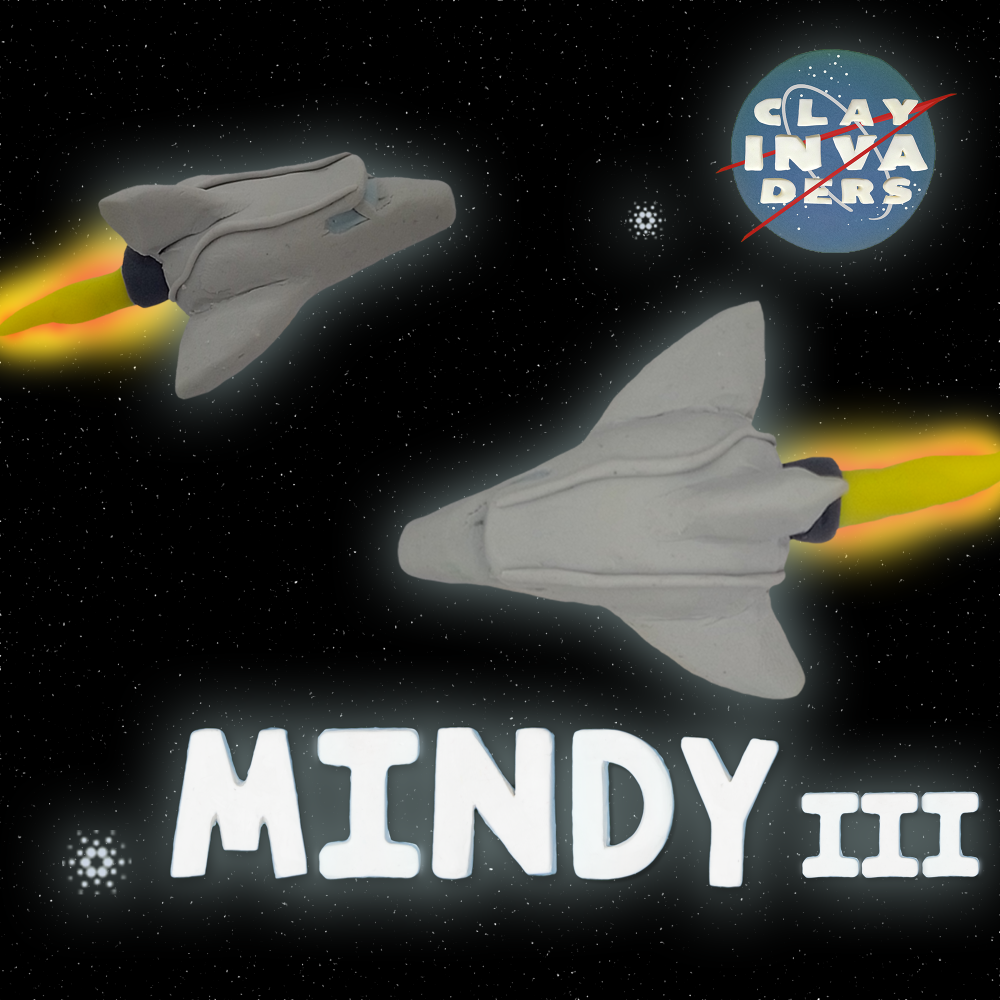
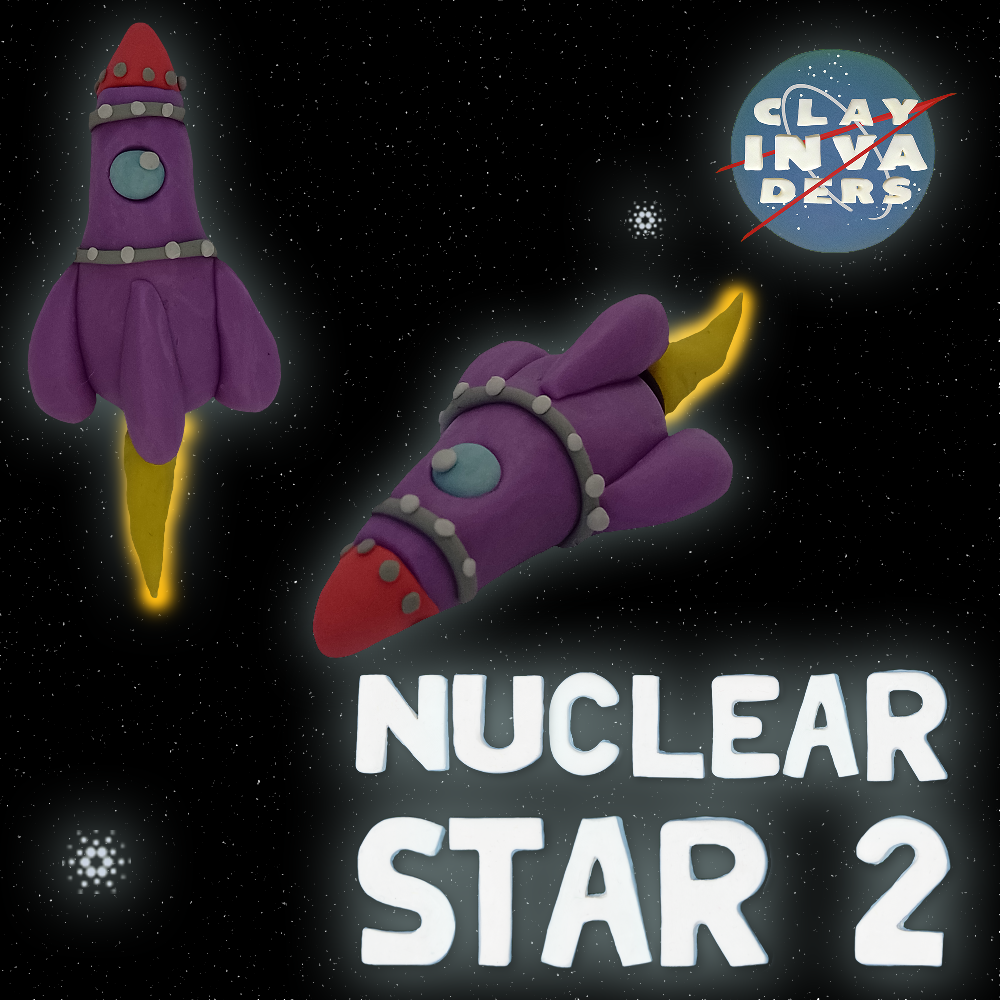

# Ships

**To help protect, transport, and discover new Clay Invaders, we have 9 spaceships**&#x20;

Holders will have a chance to mint a spaceship. There are only 50 spaceship NFTs and each crew member duplicates your chances to mint one

Each Spaceship works as a Unit, and plays are core role in [the GAME](broken-reference)&#x20;

**There are 9 types of Spaceships: (50/10K)**&#x20;

<figure><figcaption></figcaption></figure>

 

<figure><figcaption></figcaption></figure>

 

<figure><figcaption></figcaption></figure>

 

<figure><figcaption></figcaption></figure>

 

<figure><figcaption></figcaption></figure>

 

<figure><figcaption></figcaption></figure>

 

<figure><figcaption></figcaption></figure>

 

<figure><figcaption></figcaption></figure>

 

<figure><figcaption></figcaption></figure>

