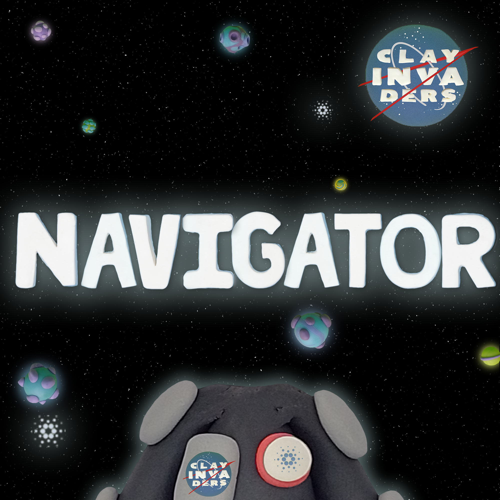

# Suits

**Spacesuits make up 2000 of the 10K Clay Invaders that exist.**&#x20;

They are the reason Clay Invaders can navigate to other Galaxies safely and find amazing artifacts on other planets while having fun doing so!&#x20;

Being a crew member means you play an important role in Clay Invaders and you have important decisions to decide upon for the community.&#x20;

A Crew member also gives you a higher chance of minting 1 of the 50 Clay Invader spaceships. Yes, you heard that right!&#x20;

There will only be 50 spaceships in total to mint and each Crew Member in the wallet duplicate the chance to mint a spaceship :rocket:

**There are 7 types of Crew Members: (2K/10K)**&#x20;

* Commander&#x20;
* Pilot&#x20;
* Navigator&#x20;
* Engineer&#x20;
* Scientist&#x20;
* Explorer&#x20;
* Doctor&#x20;

As another famous alien said, "With great power comes great responsibility"&#x20;

**Are you ready to be a Crew Member?**

<figure><figcaption></figcaption></figure>

 

<figure><figcaption></figcaption></figure>

 

<figure><figcaption></figcaption></figure>

 

<figure><figcaption></figcaption></figure>

 

<figure><figcaption></figcaption></figure>

 

<figure><figcaption></figcaption></figure>

 

<figure><figcaption></figcaption></figure>

