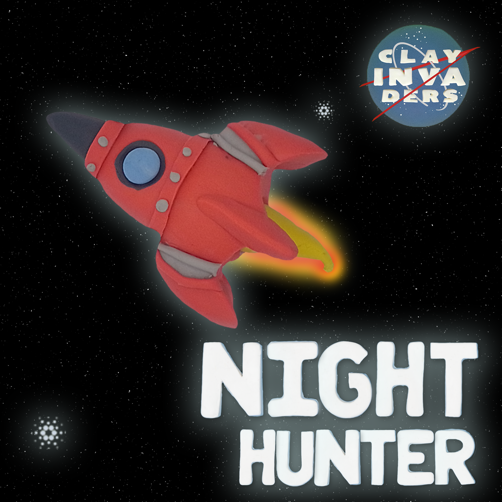

# Description

## **Intro**

There are only 9 types of Spaceships and 50 Units in total for the Clay Invaders NFT Collection

This is a collaborative game, every NFT owner could choose what SpaceShip unit to join and work together to achieve the goal.

Each SpaceShip is a **unit**, where all participants should help to play and complete the missions of the game

### Roles

Each NFT has an associated role (described in metadata), the possible roles are:

* **Spaceship**
* **Crew**
  * **Commander** ****
  * **Pilot** ****
  * **Navigator** ****
  * **Engineer** ****
  * **Explorer** ****
  * **Doctor** ****
  * **Scientist** ****
* **Passengers**

### Spaceship's Crew

Each Spaceship has a different size and max crew needed, as described below:

| Ships \ Crew (#Quantity)                                                                               | #Ships | Commander (20) | Pilot (50) | Engineer (300) | Scientist (300) | Navigator (300) | Explorer (500) | Doctor (500) |
| ------------------------------------------------------------------------------------------------------ | ------ | -------------- | ---------- | -------------- | --------------- | --------------- | -------------- | ------------ |
| Serenity                 | 10     | 1              | 1          | 2              | 2               | 2               | 4              | 4            |
| Wolf of the Night  | 10     | 1              | 1          | 2              | 2               | 2               | 4              | 4            |
| Nuclear Star 2       | 5      | 1              | 2          | 4              | 4               | 4               | 8              | 8            |
| Night Hunter          | 1      | 1              | 4          | 8              | 8               | 8               | 16             | 16           |
| Nostromuz               | 5      | 1              | 2          | 4              | 4               | 4               | 8              | 8            |
|  Mork                        | 3      | 1              | 3          | 6              | 6               | 6               | 12             | 12           |
| Mindy III                | 3      | 1              | 3          | 6              | 6               | 6               | 12             | 12           |
| Hypersonic             | 3      | 1              | 3          | 6              | 6               | 6               | 12             | 12           |
| Discover IV            | 10     | 1              | 1          | 2              | 2               | 2               | 4              | 4            |

****
